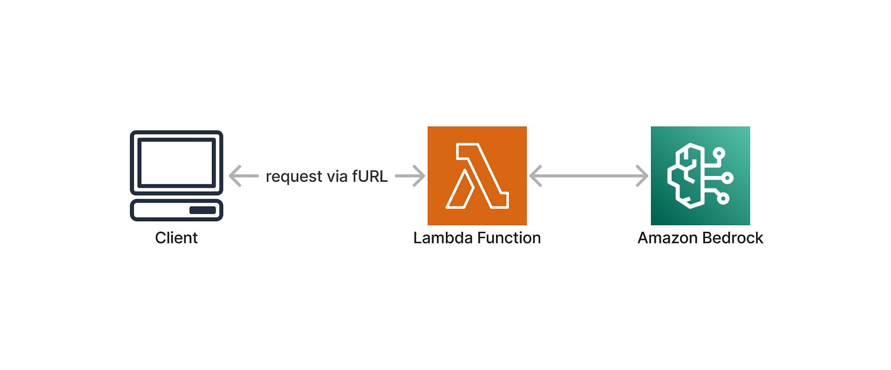

# Overview

This side project is a template on how to utilize AWS Lambda Function URL's streaming response feature with Amazon Bedrock.

# Prerequisites

1. Configure your AWS profile: export `AWS_PROFILE=<your-profile-name> `
2. Install dependencies: `npm install`
3. Request for Anthropic's Claude V2 foundational model in the AWS Management Console.

# Deploy and test

1. Deploy the serverless application: `npm run sls -- deploy`
2. Invoke using curl: `curl -N <your-lambda-function-url>`
